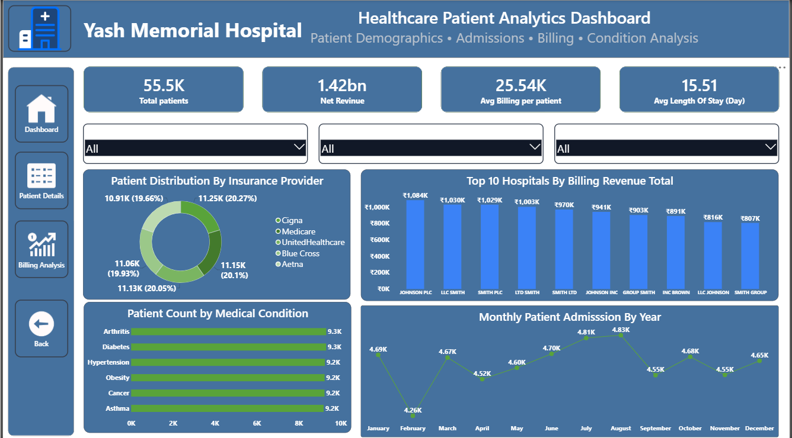
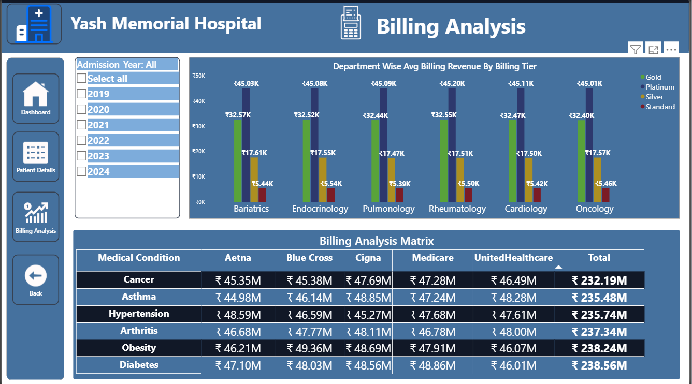
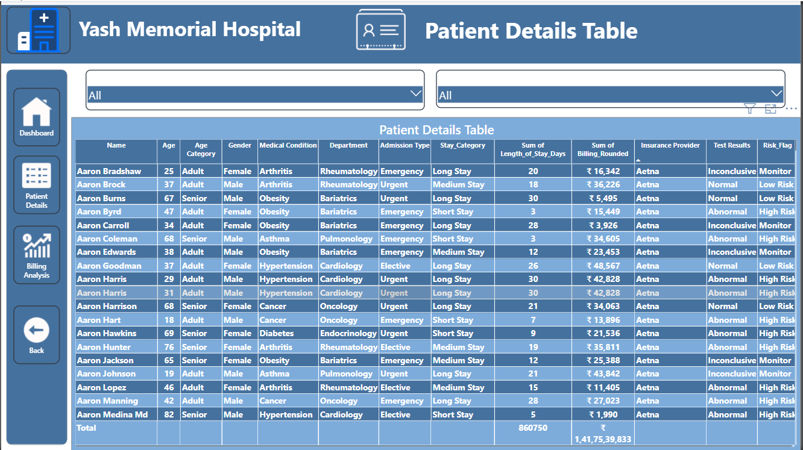

# 🏥 Healthcare Patient Analytics Dashboard

<p align="center">
  
  
  
  
</p>

---

## 📌 Project Overview

This project is an interactive **Healthcare Patient Analytics Dashboard** built using **Microsoft Power BI**.

The dashboard helps hospitals analyze patient information, billing revenue, insurance providers, admissions, and medical conditions through interactive visualizations.

---

# 📊 Dashboard Preview

## 🏠 Main Dashboard



---

## 💰 Billing Analysis Dashboard



---

## 👨‍⚕️ Patient Details Dashboard



---

# 🚀 Features

- Interactive Dashboard
- KPI Cards
- Dynamic Filters & Slicers
- Billing Revenue Analysis
- Patient Demographics
- Insurance Provider Analysis
- Department Wise Revenue
- Monthly Admission Trends
- Medical Condition Analysis
- Patient Details Table

---

# 🛠️ Tools & Technologies

- Microsoft Power BI
- Power Query
- DAX
- CSV Dataset
- Data Cleaning
- Data Modeling
- Interactive Visualization

---

# 📂 Dataset

The project uses:

- healthcare_dataset.csv
- Condition_Dept_Lookup.csv

---

# 📁 Project Files

```
Healthcare-Patient-Analytics-PowerBI-Dashboard
│
├── PR2_Healthcare_Analysis.pbix
├── healthcare_dataset.csv
├── Condition_Dept_Lookup.csv
├── README.md
│
└── Screenshots
      ├── Patient_Analysis.png
      ├── Billing_Analysis.png
      └── Patient_Details.png
```

---

# 🎯 Skills Demonstrated

- Data Cleaning
- Data Transformation
- Power Query
- DAX Measures
- Data Modeling
- Dashboard Design
- Business Intelligence
- Healthcare Analytics
- Data Visualization

---

# 👨‍💻 Author

**Prajapti bhargav**


---

⭐ If you like this project, don't forget to star the repository.
